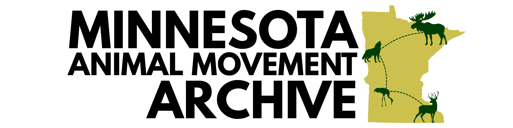

Welcome to the Minnesota Animal Movement Archive. This living archive is a collection documenting wildlife movement and behaviors across the state of Minnesota. We aim to bring together datasets from Environment and Natural Resources Trust Fund (ENRTF) projects and partnerships with State, Tribal, Federal, and University researchers to create a unified resource for understanding how Minnesota's wild animals navigate and use their habitats.

## Get more info

Visit our [website](https://smthfrmn.github.io/minnesota-animal-movement-archive/) to learn more about the [project](https://smthfrmn.github.io/minnesota-animal-movement-archive/faq.html), [how to participate](https://smthfrmn.github.io/minnesota-animal-movement-archive/submission_guide.html), or to [contact us](https://smthfrmn.github.io/minnesota-animal-movement-archive/about.html).

## Participating Studies

This initiative began summer of 2025 and the archive is actively growing, take a look at the studies participating so far: