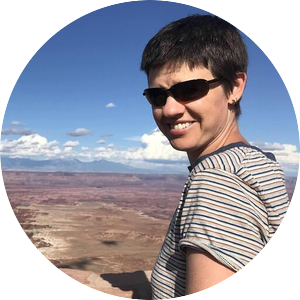

The archive is a collection of studies in [Movebank](https://www.movebank.org/) that contain animal movement and other animal-borne sensor data from the state of Minnesota. With this archive, we aim to bring together datasets from Environment and Natural Resources Trust Fund (ENRTF) projects and partnerships with State, Tribal, Federal, and University researchers to create a unified resource for understanding how Minnesota's wildlife navigate and use their habitats.

Checkout the [FAQ](faq.qmd), [Submission Guide](submission_guide.qmd), and [About Us](about.qmd) to learn more.

The map above depicts animal movement studies gathered from LCCMR grants, Movebank, and Motus. Points in green are studies already in the archive. Click on dots to see details about the data.

We are supported by an ENRTF grant: [Data/Tools to Maximize Impact of ENTRF Projects](https://www.lccmr.mn.gov/proposals/2025/originals/proposal_2025-111.pdf). Long-term maintenance and support is provided by the University of Minnesota and Movebank. For more information about participating in, or using the Minnesota Animal Movement Archive, contact Smith at freem850\@umn.edu.
 
 

::: columns
::: {.column width="30%"}
{width=300}
:::

::: {.column width="2%"}
:::

::: {.column width="68%"}
::: {style="line-height: 1.2;padding-left=100"}
 
 
**Dr. John Fieberg** 
Professor of Quantitative Ecology 
University of Minnesota  
[Website](https://fieberg-lab.cfans.umn.edu/) 
:::
:::
:::

::: columns
::: {.column width="30%"}

:::

::: {.column width="2%"}
:::

::: {.column width="68%"}
::: {style="line-height: 1.2;padding-left=100"}
 
 
 
**Smith Freeman**  
Conservation Science PhD Student  
University of Minnesota  
:::
:::
:::

