## Overview

[MoveApps](https://www.moveapps.org/) is a free analysis platform for animal tracking data hosted by the Max Planck Institute of Animal Behavior. The aim is to empower the movement ecology community to make sophisticated analytical tools accessible to a larger audience. 

You can perform many different kind of analyses, generate summaries, and animate movement data using "Workflows" which are composed of a series of "Apps." MoveApps naturally integrates with Movebank, so if your data are in Movebank, getting up and running on MoveApps will be easy.

This page walks through a few popular Workflows in MoveApps, with example outputs dropped below each section.

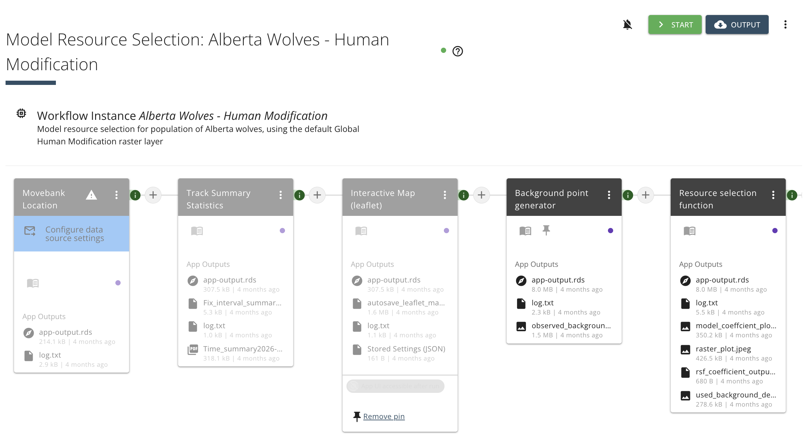

---

## Resource Selection Functions (RSFs)

MoveApp's RSF App estimates how animals select habitat relative to what's
available, typically by comparing used locations to background/available
points and fitting a selection function against environmental covariates
(land cover, elevation, distance to roads, canopy cover, etc.). MoveApps provides
a number of spatial layers (i.e., percent tree cover, land cover type, global human modification, and elevation).

#### Example Workflow
[Alberta Wolves - Human Modification](https://www.moveapps.org/workflows/public/13294ae4-22d5-499f-9327-5ee40d2d3a28)

Model resource selection for population of Alberta wolves, using the default Global Human Modification raster layer

#### Example output
::: {.callout-tip appearance="minimal"}
::: {layout-ncol=3}
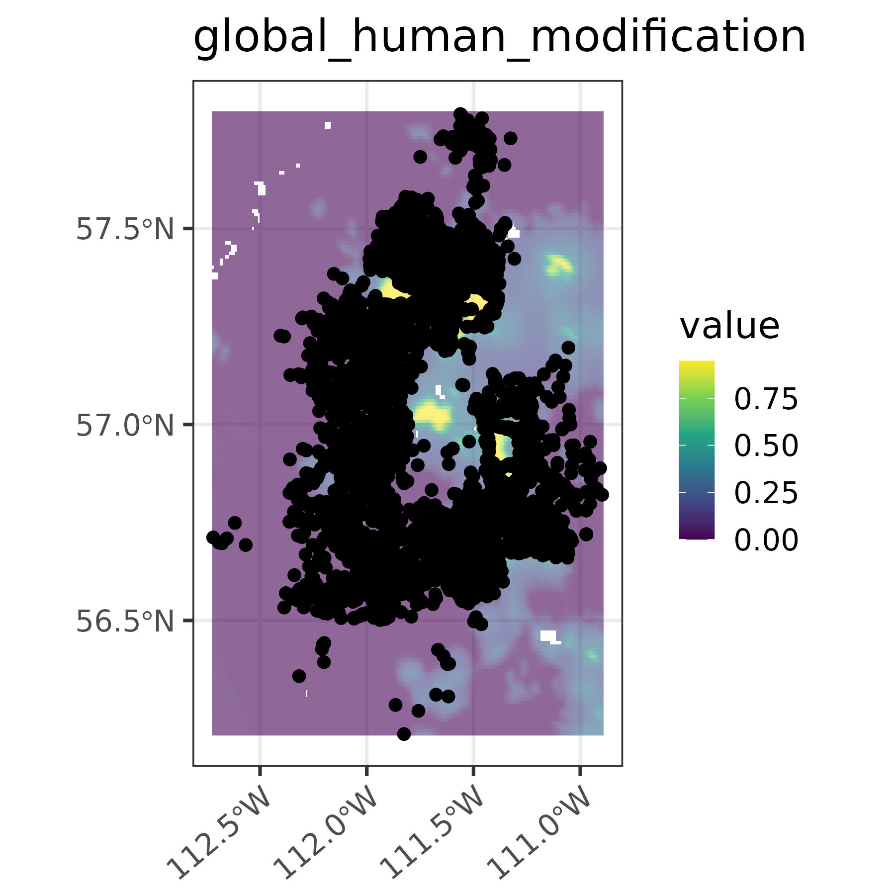

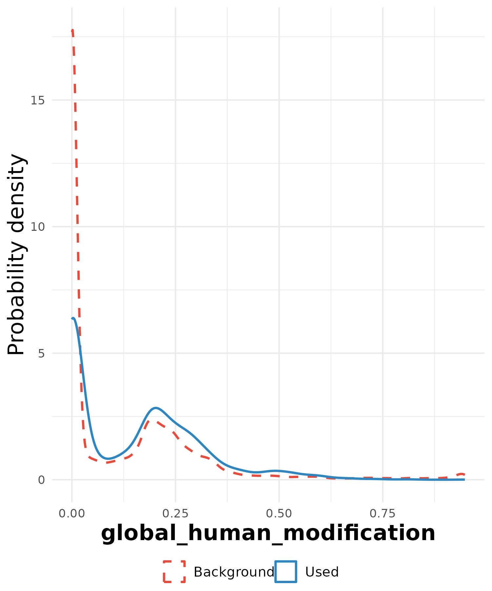

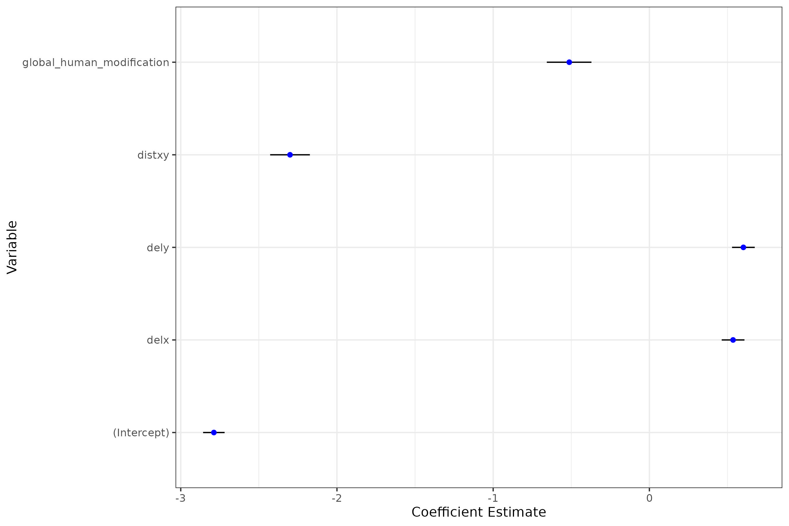
:::
:::

---

## Home Range & Space Use

Apps in this category estimate space use from GPS fixes — including
autocorrelated kernel density estimation (AKDE), minimum convex polygons, and
utilization distributions — useful for territory size, overlap, and seasonal
range comparisons.

#### Example Workflow
[Range Estimation](https://www.moveapps.org/workflows/public/e144afb4-37eb-4c8a-aa83-b0c5f9c7027b)

Assess and map space use by two methods: Home Range Kernel Utilization Distribution (estimates the utilization distribution [based on the R 'adehabitat' package] at a user-defined isopleth and provides population and individual home range polygons) and Recent core area range and points (estimates the core area [50% isopleth, based on the R 'amt' package] of individual animals across user-defined time period and provides and overview of the number of locations in the core area by time).

#### Example output
::: {.callout-tip appearance="minimal"}
::: {layout-ncol=1}
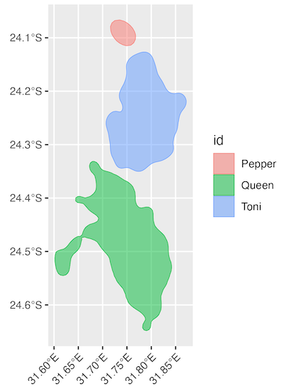
:::
:::

---

## Animations

MoveApps has an App that renders movement tracks as animated GIFs/MP4s over a
basemap. Can be useful for presentations, outreach, or spot-checking odd
trajectories.

#### Example Workflow
[Sandhill & Trumpeter Swan Animations](https://www.moveapps.org/workflows/public/2208eb2f-dc5a-48f9-b4e7-82273ea774b9)

#### Example output
::: {.callout-tip appearance="minimal"}
::: {layout-ncol=2}
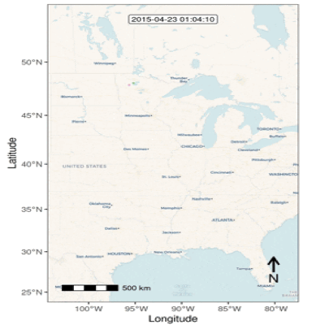

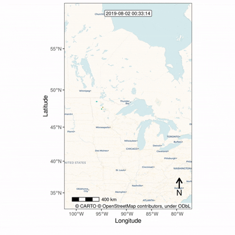
:::
:::

## Data Summaries

MoveApps offers data summary apps that allow you to see things like fix rate,
number of locations, mean fix interval times, and downloadable interactive maps.

#### Example Workflow
[Data Summary & Map](https://www.moveapps.org/workflows/public/20b7788d-27fd-4e71-b568-f71f83466634)

Use this workflow to get data from Movebank and check how it is read by MoveApps. Read data from Movebank and review a summary of the temporal scope of the data and an interactive map. Then convert to csv for download, with the study details and reference data included.

#### Example output
::: {.callout-tip appearance="minimal"}
::: {layout-ncol=2}
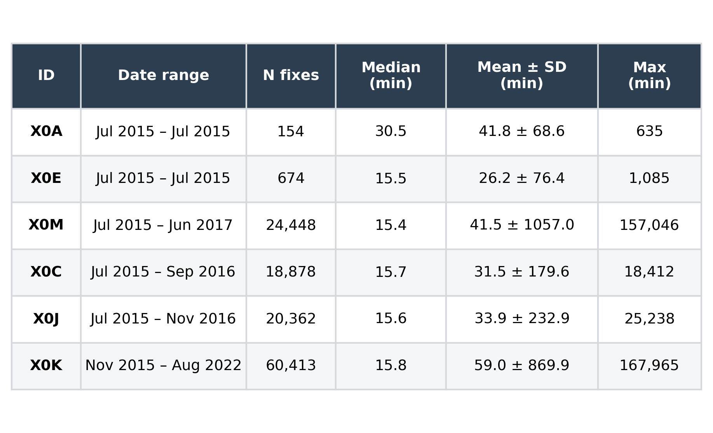

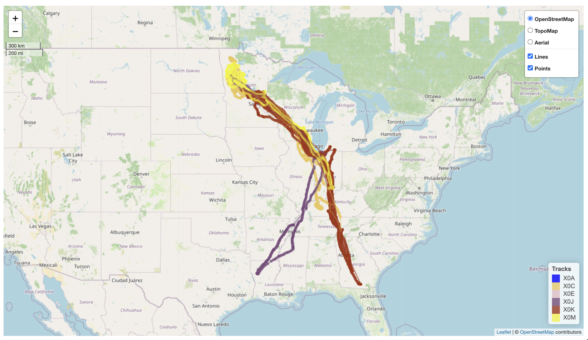

:::
:::

---

## Movement Metrics

MoveApps also has Apps that derive step-level and trajectory-level metrics (e.g., step length,
turning angle, speed, net squared displacement, elevation) which feed into
behavioral state classification or step-selection analysis downstream.

#### Example Workflow
[Movement Statistics of Sandhill Cranes](https://www.moveapps.org/workflows/public/b3dc6bdd-dc04-4da6-ac57-b1fab35861e1)

Example workflow to explore bird/bat flight behavior. It calculates between-location speed and compares it with ground speed. Exploring the different height and elevation measures. This is an updated Workflow of the name sake from 2023.

#### Example output
::: {.callout-tip appearance="minimal"}
::: {layout-ncol=3}
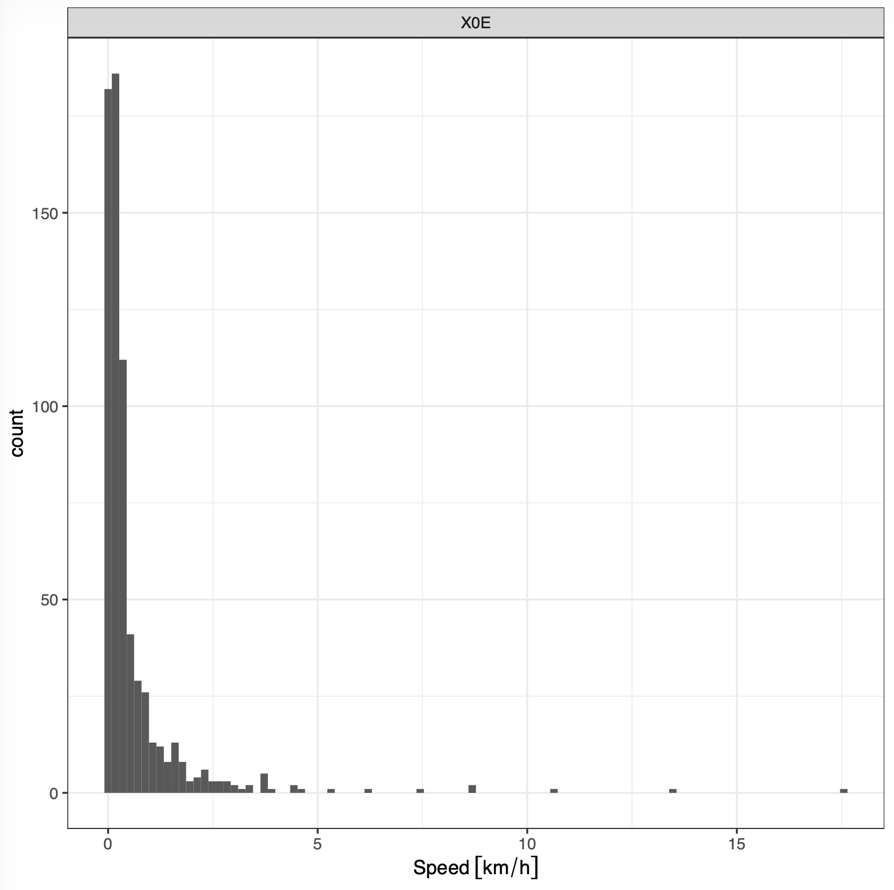

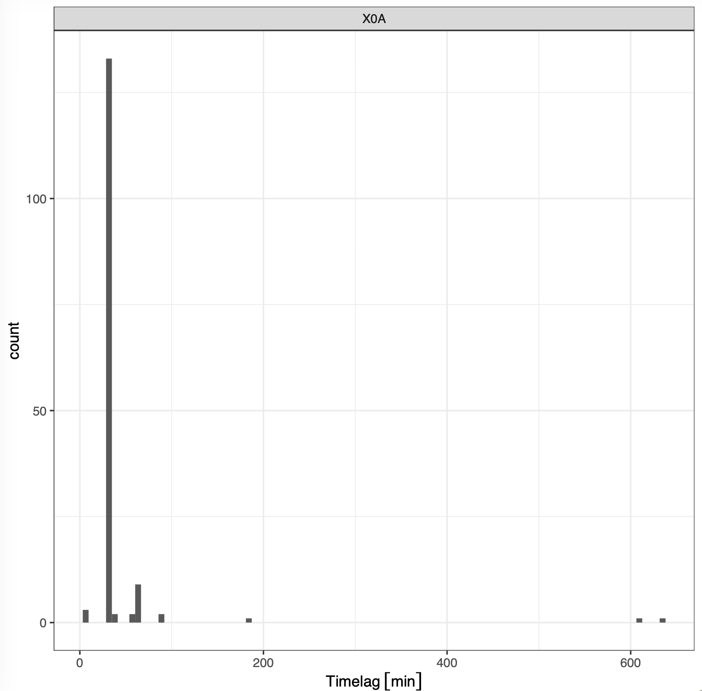

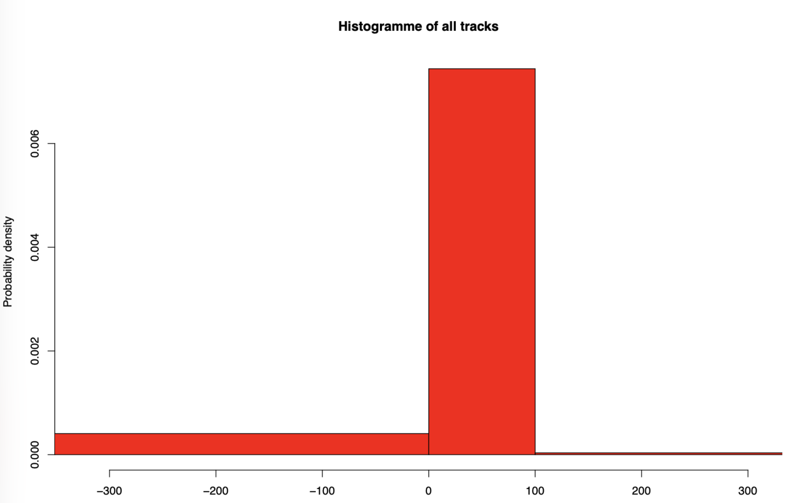
:::
:::